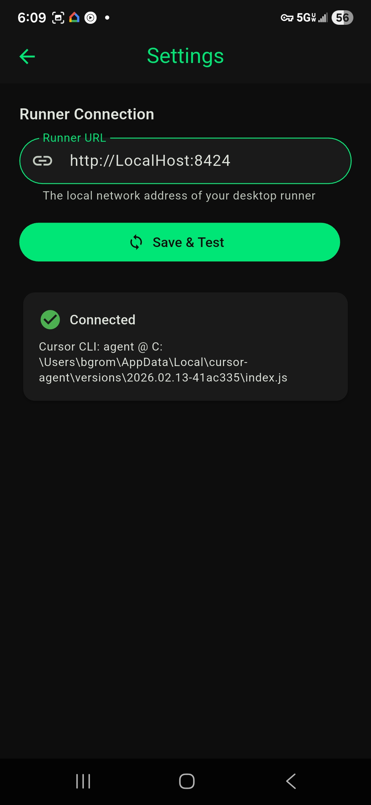
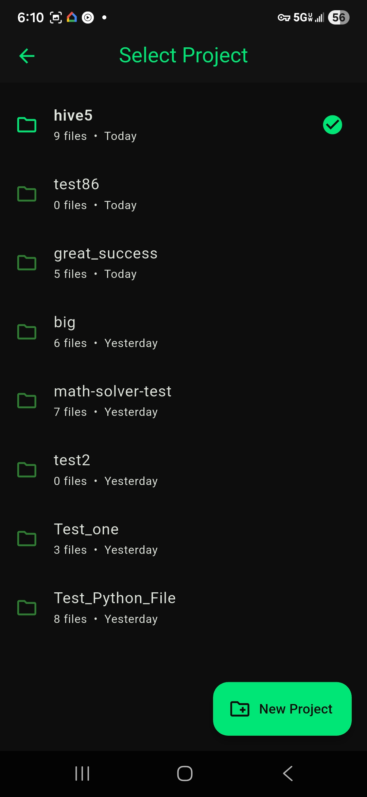
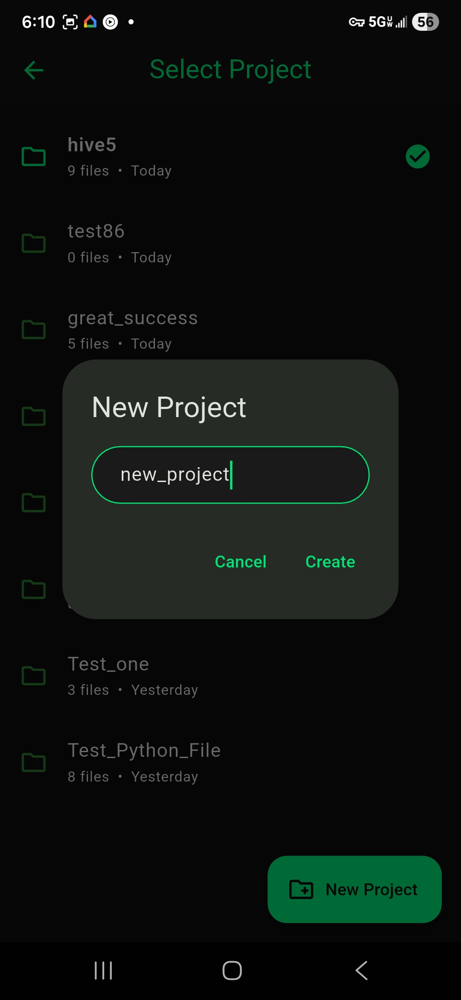
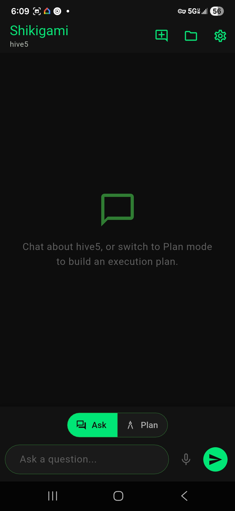
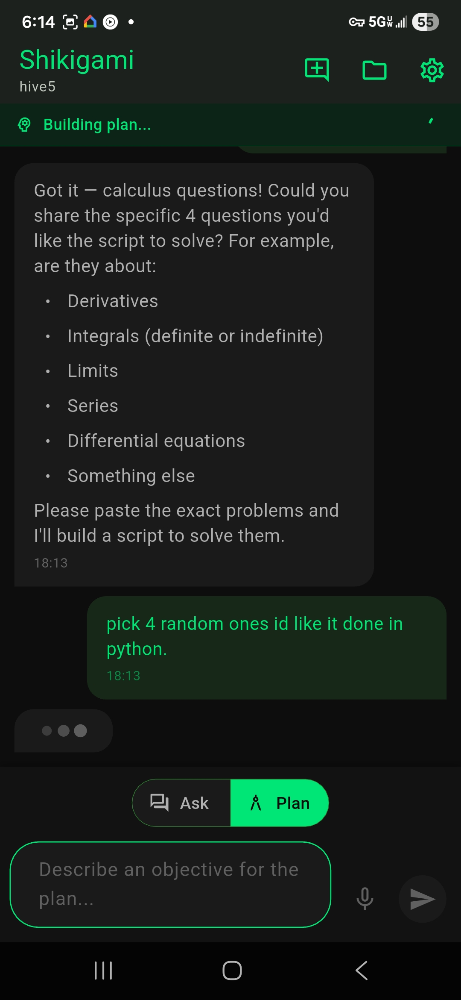
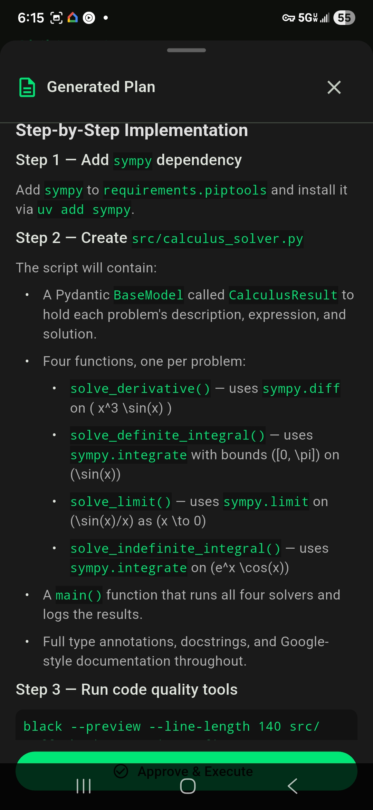
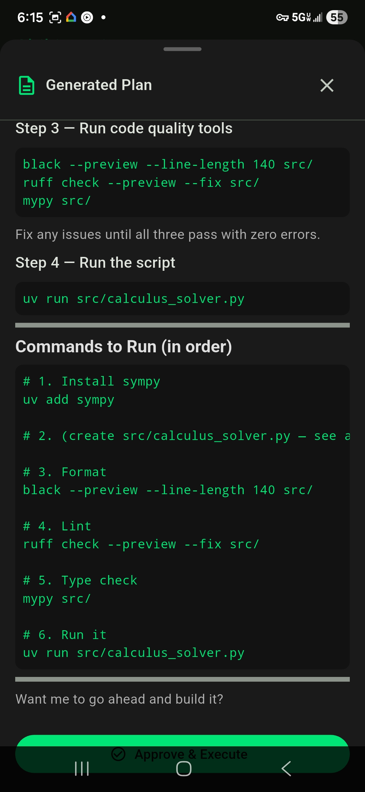
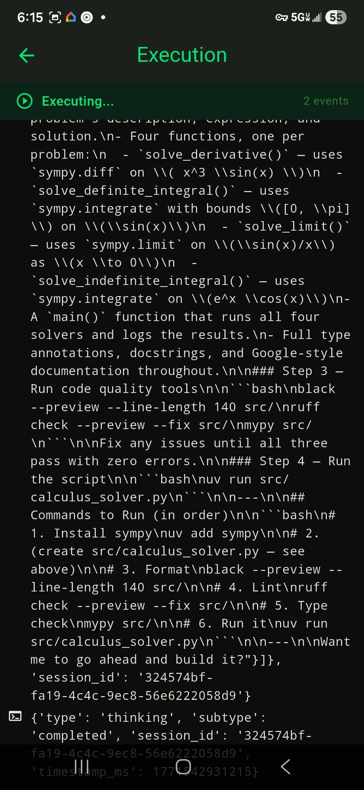
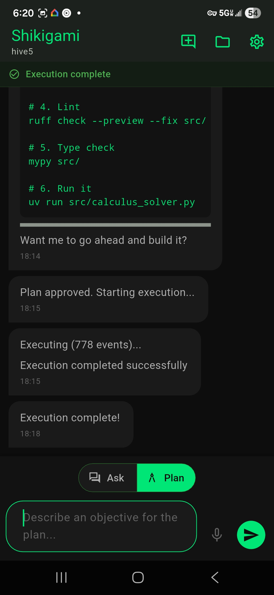

# Shikigami

Control Cursor's AI agent from your phone. Ask questions, build plans, review them, and execute code changes -- all from a chat interface on your Android or iOS device, while Cursor runs on your desktop.

Your phone connects to the runner over [Tailscale](https://tailscale.com/), so it works from anywhere -- not just your local Wi-Fi. Couch, coffee shop, different building, doesn't matter. As long as both devices are signed into Tailscale, they can talk to each other.

```
+------------------+        HTTP/JSON         +------------------+
|                  |  <------- via -------->  |                  |
|  Android App     |       Tailscale VPN      |  Runner Service  |
|  (Flutter)       |                          |  (Docker)        |
|                  |                          |                  |
+------------------+                          +--------+---------+
                                                       |
+------------------+        HTTP/JSON                  |
|  iOS / Browser   |  <---- via Tailscale ---->        |
|  (Web PWA)       |     served from runner            | subprocess
+------------------+                                   v
                                              +------------------+
                                              | Cursor Agent CLI |
                                              | (Node.js)        |
                                              +------------------+
```

## Architecture

The system has two parts:

- **Runner** (`runner/`) -- A Python FastAPI service that runs on your desktop inside a Docker container. It receives HTTP requests from your phone, translates them into Cursor Agent CLI invocations, and streams results back. Think of it as a bridge between your phone and the Cursor agent.

- **Android App** (`android_app/`) -- A Flutter app that provides a chat interface for interacting with the runner. Supports voice input, Markdown rendering, plan review, and live execution monitoring.

- **Web PWA** (`runner/web_app/`) -- *Under construction.* A pre-built Flutter web app served from the runner at `/app`. Intended for browser and iOS home-screen use. Not yet fully functional -- see [Known Issues & Roadmap](#known-issues--roadmap).

Your phone and desktop find each other through **Tailscale**, a zero-config VPN that gives each device a stable IP address. No port forwarding, no firewall rules, no "are we on the same Wi-Fi?" headaches.

### Workflow

1. **Ask** -- Send a read-only question to the Cursor agent. It reads your project files and answers without modifying anything.
2. **Plan** -- Describe an objective and the agent generates a detailed Markdown implementation plan.
3. **Review** -- Read the plan on your phone, make sure it looks right.
4. **Approve & Execute** -- One tap to approve and start execution. The agent implements the plan with full file access.
5. **Monitor** -- Watch execution progress in real-time from the chat screen.

### Screenshots

<p align="center">




</p>

<p align="center">




</p>

<p align="center">


</p>

---

## Setup

Before you start, you'll need three things: **Docker**, a **Cursor API key**, and **Tailscale** on both your PC and your phone.

### Prerequisites

- **Docker Desktop** installed and running ([download](https://www.docker.com/products/docker-desktop/))

### Step 1 -- Get your Cursor API key

The runner needs an API key to talk to the Cursor agent.

1. Go to your Cursor dashboard: [cursor.com/dashboard](https://cursor.com/dashboard)
2. Open the **Integrations** tab
3. Generate an API key and copy it -- you'll need it in Step 4

### Step 2 -- Install Tailscale

Tailscale is how your phone reaches the runner on your PC. It creates a private network between your devices so they can talk to each other from anywhere -- no port forwarding needed.

1. **Download and install Tailscale on your PC** from [tailscale.com/download](https://www.tailscale.com/download)
2. Sign in (or create an account -- it's free for personal use)
3. **Install Tailscale on your phone** as well (search "Tailscale" in the Play Store or App Store)
4. Sign in on your phone with the **same account**

Both devices are now on the same Tailscale network.

### Step 3 -- Find your PC's Tailscale IP

Once Tailscale is connected on both devices:

1. Open Tailscale on your PC
2. Go to the **Network** / **Machines** view
3. Find your PC in the device list and click on it
4. Copy the IP address shown (it starts with `100.`)

This is the IP your phone will use to reach the runner. It's stable -- it doesn't change when you switch Wi-Fi networks.

### Step 4 -- Configure the runner

Copy the example environment file and fill in your values:

```bash
cp .env.example .env
```

Open `.env` and set your Cursor API key and project folder:

```env
# Your Cursor API key from Step 1
CURSOR_API_KEY=your_api_key_here

# Where your project folders live
PROJECT_ROOT=C:\Users\YourName\Downloads\_projects

# Port the runner listens on (default is fine)
RUNNER_PORT=8423
```

**macOS/Linux** users just change the project path:

```env
PROJECT_ROOT=/Users/yourname/projects
```

> **Tip:** `PROJECT_ROOT` is the folder where your projects live. The runner scans it and shows each sub-folder as a selectable project in the app. You can point this at any directory.

### Step 5 -- Start the runner

```bash
docker compose up --build
```

First build takes a few minutes (downloads Python, installs the Cursor agent CLI, etc.). Subsequent starts are fast because Docker caches the layers.

You should see:

```
runner-1  | INFO:     Uvicorn running on http://0.0.0.0:8423 (Press CTRL+C to quit)
```

Verify it's working on your desktop:

```
http://localhost:8423/health
http://localhost:8423/docs       # Interactive Swagger UI
```

### Step 6 -- Connect from your phone

**Android app:** Open the Shikigami app and enter your PC's Tailscale IP from Step 3: `http://100.x.x.x:8423`

**iPhone / iPad (Web PWA):** Open Safari and go to:

```
http://100.x.x.x:8423
```

Replace `100.x.x.x` with your Tailscale IP. The runner automatically redirects to the built-in web app. To install it as a home-screen app:

1. Tap the **Share** button (square with arrow) in Safari
2. Scroll down and tap **Add to Home Screen**
3. Tap **Add**

The app will launch full-screen with no browser chrome -- it looks and feels like a native app. No App Store, no Mac, no build tools needed. The connection to the runner is automatic since the app is served from it.

Replace `100.x.x.x` with the IP you copied. Anywhere you see `localhost` in configuration or docs, you can swap it for this Tailscale IP to access the runner from your phone.

> **Why Tailscale instead of local Wi-Fi?** Local IP addresses change when you switch networks, and your phone and desktop have to be on the same Wi-Fi. Tailscale gives each device a permanent `100.x.x.x` address that works from anywhere -- home, office, mobile data, different buildings. No port forwarding or firewall rules needed.

### Step 7 -- Stop the runner

```bash
docker compose down
```

This cleanly stops the container and **immediately releases the port**. No orphan processes, no stuck ports. Next time you want to run it, just `docker compose up` again (no `--build` needed unless you changed code).

---

## Managing the Runner

### Everyday commands

| What you want | Command |
|---------------|---------|
| Start the runner | `docker compose up` (add `-d` to run in background) |
| Start + rebuild after code changes | `docker compose up --build` |
| Stop the runner | `docker compose down` |
| View logs (if running in background) | `docker compose logs -f` |
| Restart the runner | `docker compose restart` |
| Check if it's running | `docker compose ps` |

### Why Docker?

Running the runner directly with Python on Windows can leave zombie processes that hold the port open even after you close the terminal. This happens because the runner spawns Node.js subprocesses (the Cursor agent) and Windows doesn't always clean them up.

Docker eliminates this entirely:
- `docker compose down` kills the container and all its child processes
- The port is released immediately -- no ghost sockets
- `docker compose up` always starts clean
- The service is isolated from your system Python

### Running in background mode

If you don't want to keep a terminal window open:

```bash
# Start in the background
docker compose up -d

# Check that it's running
docker compose ps

# View live logs when you need them
docker compose logs -f

# Stop it
docker compose down
```

---

## Configuration Reference

The runner is configured through two layers:

1. **`.env` file** (in the project root, next to `docker-compose.yml`) -- controls Docker volume mounts and the host port
2. **`RUNNER_` environment variables** -- control the runner application itself (set in `docker-compose.yml` or overridden in `.env`)

### Docker-level settings (`.env` file)

| Variable | Default | Description |
|----------|---------|-------------|
| `CURSOR_API_KEY` | *(required)* | Your Cursor API key for agent authentication |
| `PROJECT_ROOT` | `~/Downloads/_projects` | Host path to your projects folder |
| `RUNNER_PORT` | `8423` | Port exposed on the host |

### Application-level settings

These are set in `docker-compose.yml` and generally don't need to be changed:

| Variable | Default | Description |
|----------|---------|-------------|
| `RUNNER_PROJECT_ROOT` | `/projects` | Container-internal path (mapped from `PROJECT_ROOT`) |
| `RUNNER_ARTIFACTS_DIR` | `/data/jobs` | Container-internal artifact storage |
| `RUNNER_CURSOR_TIMEOUT_SECONDS` | `180` | Max seconds per agent CLI invocation |
| `RUNNER_PROJECT_SCAN_DAYS` | `10` | Only show projects modified within N days |

---

## Running Without Docker (Development)

If you're developing the runner itself, you can run it directly:

```bash
cd runner

# Create virtual environment and install dependencies
uv venv
uv pip install -e .

# Start the runner
.venv\Scripts\python -m runner.main    # Windows
.venv/bin/python -m runner.main        # macOS/Linux
```

The runner starts on `http://0.0.0.0:8423`. If you see a port-in-use error, see [Troubleshooting](#troubleshooting).

> **Note:** When running directly, you may encounter orphan processes that hold the port after you stop the runner. This is a known Windows issue. Docker is recommended for this reason.

---

## iOS / Web PWA (Under Construction)

> **Status:** The web PWA is included in the runner but is not yet fully functional. It is served at `/app` and can load in a browser, but has not been tested end-to-end on iOS Safari. This is an active area of development.

The runner includes a pre-built Flutter web app at `/app`. When you open the runner URL in any browser, it redirects to the Shikigami chat UI. The goal is to support iPhone and iPad users without requiring a Mac or the App Store.

### Install as a home-screen app on iPhone

1. Open Safari on your iPhone
2. Navigate to `http://<Tailscale-IP>:8423`
3. Tap the **Share** button (square with up arrow)
4. Tap **Add to Home Screen**
5. Tap **Add**

The app launches full-screen with a dark theme, just like a native app.

### Rebuilding the web app (after Flutter code changes)

If you modify the Flutter source in `android_app/`, rebuild the web PWA:

```bash
cd android_app
flutter build web --release --base-href "/app/"
```

Then copy the build output to the runner:

```bash
# Remove old build
rm -rf runner/web_app

# Copy new build (PowerShell)
Copy-Item -Path android_app\build\web -Destination runner\web_app -Recurse

# Copy new build (macOS/Linux)
cp -r android_app/build/web runner/web_app
```

Rebuild the Docker container to pick up the changes:

```bash
docker compose up --build
```

---

## Android App Setup

### Build from source

1. Open `android_app/` in Android Studio
2. Let Gradle sync and resolve dependencies
3. Connect your phone via USB or start an emulator
4. Hit **Run**

### First launch

The app guides you through setup:

1. **Connect** -- Enter the runner URL using your desktop's Tailscale IP (e.g. `http://100.103.98.62:8423`). Tap Connect.
2. **Pick a project** -- Select a project folder from the list (these come from the runner's project root).
3. **Start chatting** -- Use "Ask" mode to ask questions, or switch to "Plan" mode to build an implementation plan.

---

## API Reference

The runner exposes these endpoints (full interactive docs at `/docs`):

| Method | Path | Description |
|--------|------|-------------|
| `GET` | `/health` | Health check + Cursor CLI version |
| `GET` | `/projects` | List project folders |
| `POST` | `/projects` | Create a new project folder |
| `POST` | `/ask` | Send a read-only question to the agent |
| `POST` | `/plan` | Generate an implementation plan |
| `POST` | `/approve` | Approve a plan for execution |
| `POST` | `/execute` | Start executing an approved plan |
| `GET` | `/job-status` | Poll execution progress |
| `GET` | `/events` | SSE stream of execution events |

---

## Project Structure

```
PHONEAPP/
├── .env.example                     # Template -- copy to .env and edit
├── docker-compose.yml               # Docker service definition
├── android_app/                     # Flutter Android app
│   ├── lib/
│   │   ├── main.dart                # App entry + onboarding router
│   │   ├── theme.dart               # Centralized dark theme
│   │   ├── models/                  # Data models (ask, plan, health, etc.)
│   │   ├── providers/               # State management (connection, project, job)
│   │   ├── screens/                 # Chat, settings, project picker, execution
│   │   ├── services/                # HTTP client for the runner API
│   │   └── widgets/                 # Message bubbles, status ribbon, plan card
│   └── pubspec.yaml
├── runner/                          # Python FastAPI runner service
│   ├── runner/
│   │   ├── main.py                  # FastAPI app + Uvicorn server
│   │   ├── config.py                # Pydantic Settings configuration
│   │   ├── models.py                # Request/response models
│   │   ├── state_machine.py         # Job state transitions
│   │   ├── routers/                 # API endpoints (ask, plan, approve, etc.)
│   │   ├── services/                # Cursor invoker, job manager, prompts
│   │   └── templates/               # .cursor/rules for new projects
│   ├── web_app/                     # Pre-built Flutter web PWA (served at /app)
│   ├── tests/
│   ├── Dockerfile
│   └── pyproject.toml
└── README.md
```

---

## Using an Alternative Agent Backend

The runner is designed around Cursor's agent CLI, but the integration point is narrow: a single file (`runner/runner/services/cursor_invoker.py`) handles all CLI communication. You can swap it out to use a different AI coding agent.

### What the invoker does

The invoker has two functions the rest of the system calls:

- **`invoke_cursor(prompt, project_path, mode, session_id)`** -- Runs a CLI command, waits for it to finish, returns an `AgentResult` with `.text` and `.session_id`. Used for Ask and Plan modes.
- **`invoke_cursor_streaming(prompt, project_path, session_id)`** -- Runs a CLI command and yields progress strings as they arrive. Used for Execute mode.

### What your alternative backend needs to support

At minimum, your replacement needs to:

1. **Accept a text prompt** and a **project directory path**
2. **Return a text response** (the agent's answer or plan)
3. **Optionally support sessions** (so follow-up questions have context)

Execute mode (plan implementation) additionally requires:
4. **Write access** to the project directory
5. **Streaming output** so the user sees progress

### Compatibility notes

| Feature | Required for Ask | Required for Plan | Required for Execute |
|---------|:---:|:---:|:---:|
| Accept text prompt | Yes | Yes | Yes |
| Read project files | Yes | Yes | Yes |
| Return text response | Yes | Yes | -- |
| Session continuity | Optional | Optional | Optional |
| Write/create files | No | No | Yes |
| Stream progress output | No | No | Recommended |
| Auto-approve tool calls | No | No | Yes |

### Known compatible alternatives

These agent CLIs have similar capabilities and could be adapted:

- **Claude Code CLI** (`claude`) -- Supports ask, plan, and execute with `--allowedTools` for permission control. Has session support via `--resume`.
- **Aider** (`aider`) -- Git-aware coding assistant. Strong at code editing. No built-in plan/approve flow but can be wrapped.
- **Continue** (`continue`) -- Open-source coding assistant with CLI mode.
- **Codex CLI** (`codex`) -- OpenAI's coding agent. Supports sandboxed execution.

Each of these would need a custom invoker that translates the runner's prompt format into the tool's expected input and parses the output back into `AgentResult`.

---

## Known Issues & Roadmap

### Known Issues

- **Approve & Execute button partially hidden** -- On some Android devices, the "Approve & Execute" button at the bottom of the plan review screen is partially obscured by the bottom navigation bar. A layout fix is coming to add proper padding so the button is always fully visible and tappable.

- **Web PWA not fully tested** -- The Flutter web build loads in the browser but has not been validated end-to-end on iOS Safari. Connection auto-detection, SSE streaming, and speech-to-text may behave differently in a browser context. This is under active development.

### Roadmap

- **Fix Approve & Execute button overlap** -- Adjust bottom padding on the plan review and execution screens so the action button clears the navigation bar on all devices.
- **Native iOS app** -- A full native iOS build of the Flutter app is planned. This requires a macOS build environment (Xcode). Once available, the iOS app will be distributed via TestFlight or direct `.ipa` install.
- **Web PWA stabilization** -- Complete testing and fix any issues with the browser-based PWA so it works reliably on iOS Safari, Chrome, and other mobile browsers.
- **Runner URL persistence** -- The Android app now saves the runner URL locally. Verify this works across app updates and device restarts.

---

## Contributing

This repo uses **branch protection** on `main`. Direct pushes to `main` are restricted to the repository owner.

To contribute:

1. **Fork** the repository (or create a feature branch)
2. Make your changes
3. Open a **pull request** against `main`
4. The PR will be reviewed before merging

Do not push directly to `main` -- all changes from contributors must go through a pull request.

---

## Troubleshooting

### "Cannot reach runner" from the app or browser

1. **Is the runner actually running?** Check with `docker compose ps` or visit `http://localhost:8423/health` on your desktop
2. **Is Tailscale running on both devices?** Open the Tailscale app on your phone and desktop -- both should show as connected
3. **Use your Tailscale IP** (starts with `100.`), not `localhost` -- `localhost` only works on the machine itself
4. **Can your phone reach the desktop at all?** Try pinging the Tailscale IP from your phone's browser: `http://100.x.x.x:8423/health`
5. **Firewall blocking the port?** This is rare with Tailscale (it handles firewall traversal), but if needed on Windows:

   ```powershell
   # Allow the port through Windows Firewall
   netsh advfirewall firewall add rule name="Shikigami Runner" dir=in action=allow protocol=TCP localport=8423
   ```

### Port already in use

**If using Docker** (recommended): This shouldn't happen. `docker compose down` always releases the port cleanly. If it does happen:

```bash
# Make sure the old container is fully stopped
docker compose down

# Verify nothing is using the port
netstat -ano | findstr :8423    # Windows
lsof -i :8423                   # macOS/Linux
```

**If running directly (without Docker):** Windows can leave zombie processes holding the port. This is the most common issue when running Python directly:

```powershell
# Find what's using the port
netstat -ano | findstr :8423

# Kill it by PID
taskkill /PID <pid> /F

# If the PID doesn't exist but the port is still held, wait ~60 seconds
# for Windows to release the socket, or use a different port:
$env:RUNNER_PORT=8424
.venv\Scripts\python -m runner.main
```

> **This is why Docker is recommended.** It completely avoids the orphan-process problem.

### "Cursor agent CLI not found"

The Cursor agent CLI is installed inside the Docker container during the build. If you see this error:

- Rebuild the container: `docker compose up --build`
- If building fails at the install step, check your internet connection -- the Dockerfile downloads the CLI during the build

### Agent calls fail or return auth errors

- Make sure `CURSOR_API_KEY` is set in your `.env` file. Get your key from the [Cursor dashboard](https://cursor.com/dashboard) under the **Integrations** tab.
- The API key is passed to the container as an environment variable. After changing `.env`, restart: `docker compose down && docker compose up`
- Check `RUNNER_CURSOR_TIMEOUT_SECONDS` if calls are timing out (default is 180 seconds).
- View the container logs for detailed errors: `docker compose logs -f`

### Docker build fails

- Make sure Docker Desktop is **running** (check the system tray / menu bar)
- On Windows, make sure you're using **WSL 2 backend** (Docker Desktop settings > General > "Use the WSL 2 based engine")
- If the build is slow, it's normal for the first time -- Docker is downloading base images and installing Node.js + Python dependencies. Subsequent builds are cached and fast.

---

## License

Private project. Not licensed for redistribution.
